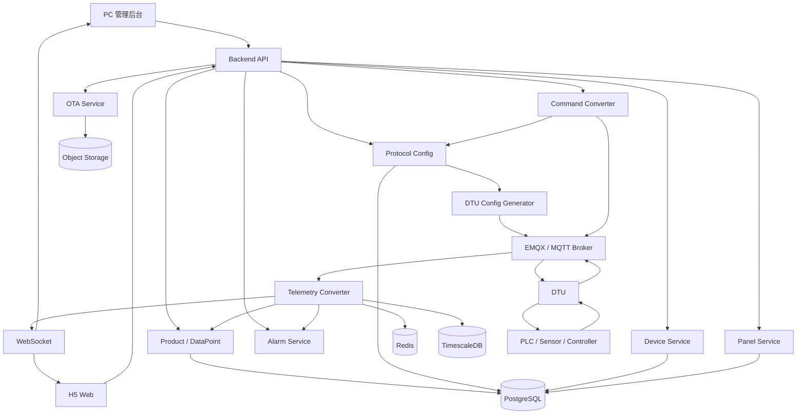
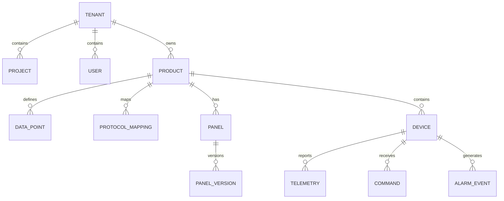
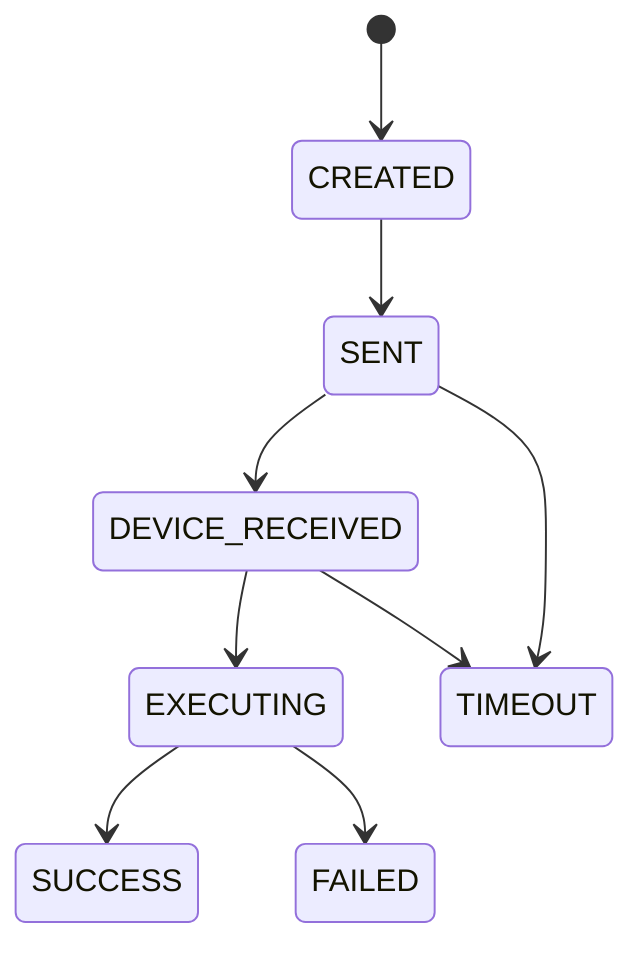
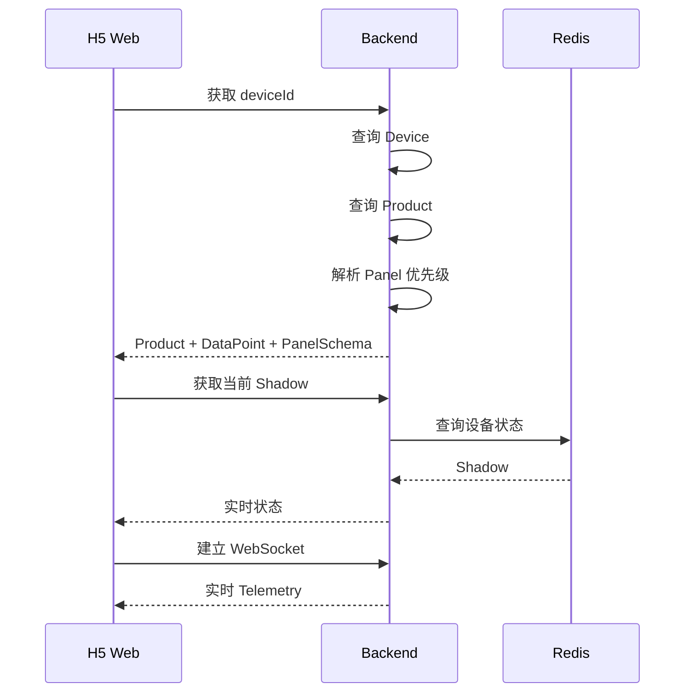
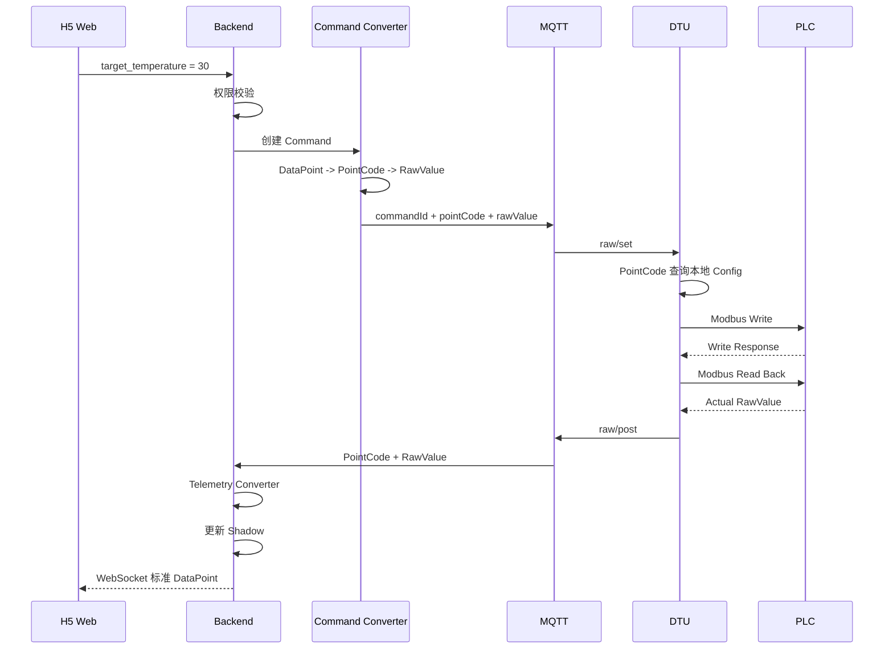
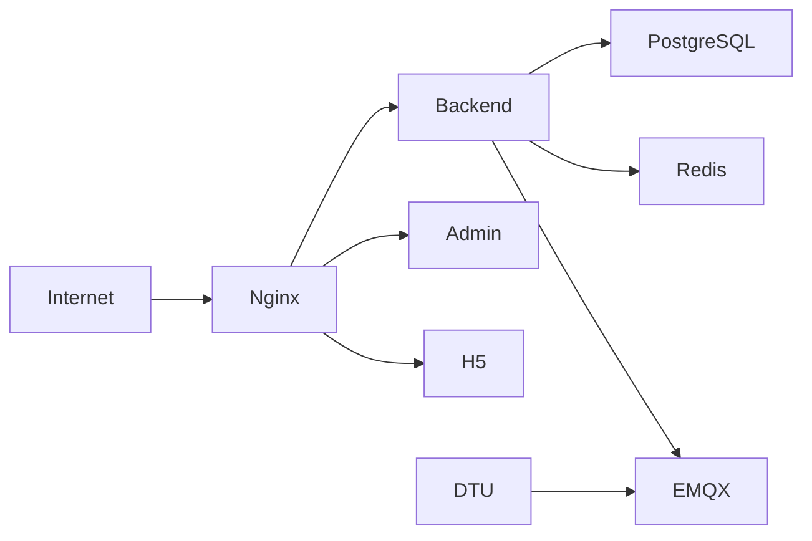

# 通用 DTU 物联网平台系统设计文档（H5 MVP / 服务端转换版）

> 文档用途：作为后续 Codex / AI Coding Agent 制定开发计划、拆分任务、设计数据库、生成项目骨架和实现 MVP 的基础输入。
>
> 文档目标：第一版建设一套“DTU 硬件 + IoT 后台 + H5 Web + 后台可配置动态面板”的通用物联网平台，使同一套系统可以接入不同 PLC、传感器、控制器及行业设备，并尽量做到新增设备型号时无需重新发布 H5 前端。后续如需上线微信小程序，可复用同一套 REST API、WebSocket、Panel Schema、DataPoint 模型和权限体系进行移植。

---

## 版本说明

当前版本正式确定：

```text
第一版用户端：H5 Web
后续终端：微信小程序

DTU：
只负责连接、采集、缓存、转发、写命令执行、配置同步、OTA。

服务端：
负责 Product / DataPoint / ProtocolMapping、
RawValue 转换、倍率/偏移、单位、枚举、Device Shadow、
历史数据、告警、权限、Panel Schema、H5 JSON。

H5：
只消费标准 DataPoint 和 Panel Schema，
不感知 Modbus 地址、Slave、功能码和 DTU 底层协议。
```

核心原则：

> 物理协议在下，DataPoint 在中，Panel 在上；所有业务数据转换统一在服务端完成。

---

# 1. 项目目标

建设一套通用 DTU 物联网平台，系统由以下四部分组成：

1. DTU 硬件与固件
2. IoT 云平台 / 后台服务
3. PC 管理后台
4. H5 Web 用户端

系统核心能力：

- DTU 通过 RS485 / RS232 / CAN 等接口连接现场设备。
- DTU 支持 4G / WiFi / Ethernet 等方式连接云端。
- MVP 优先支持 RS485 + Modbus RTU。
- DTU 本身不承担业务语义转换，只按照服务端下发的配置执行采集和写入。
- 服务端统一管理 Product、DataPoint、ProtocolMapping、DTU Config、设备、命令、历史数据、告警、OTA。
- 服务端把 DTU 上传的 PointCode + RawValue 转换成标准 DataPoint。
- H5 显示设备实时数据、历史数据并远程控制设备。
- PC 后台可以配置设备采集参数、数据点、协议映射和动态 H5 面板。
- H5 根据后台下发的 Panel Schema 动态渲染页面。
- 新增一种设备原则上只需要：
  - 创建 Product
  - 创建 DataPoint
  - 配置 ProtocolMapping
  - 生成 DTU Config
  - 配置 Panel
  - 创建设备
- 新增设备型号时，不需要修改 DTU 固件中的业务逻辑，也不需要重新开发 H5 页面。
- 后续微信小程序复用 REST API、WebSocket、DataPoint、Panel Schema 和权限体系进行移植。

# 2. 核心设计原则

## 2.1 DTU 是“配置执行器”，不是业务处理器

DTU 只理解：

```text
PointCode
Slave ID
Function Code
Register Address
Register Count
Raw Data Type
Byte Order
Scan Interval
Write Rule
```

DTU 不需要理解：

```text
temperature
pressure
power
当前温度
压力
℃
MPa
自动模式
告警文案
```

例如服务端给 DTU 下发：

```text
PointCode = 1
Slave = 1
FC = 03
Address = 0x0000
RawType = INT16
Interval = 1000ms
```

DTU 读取到：

```text
RawValue = 265
```

上传：

```text
PointCode = 1
RawValue = 265
```

到这里 DTU 的任务结束。

---

## 2.2 所有业务转换统一在服务端完成

服务器根据 Product + DataPoint + ProtocolMapping 完成：

```text
PointCode = 1
RawValue = 265
      ↓
DataPoint = temperature
      ↓
Scale = 0.1
Offset = 0
      ↓
26.5
      ↓
Unit = ℃
```

因此以下能力不放 DTU：

```text
scale
offset
unit
业务名称
枚举文案
告警文案
Panel 配置
H5 JSON 拼装
```

这样可以降低 DTU MCU、RAM、Flash 和协议耦合要求。

---

## 2.3 PointCode 与 DataPoint 必须分离

PointCode：

```text
1
2
3
4
```

作用：

```text
DTU ↔ Server 之间的轻量稳定编号
```

DataPoint：

```text
temperature
pressure
power
mode
```

作用：

```text
Server ↔ H5 / Admin / Alarm / History 的业务标识
```

映射关系：

```text
PointCode 1
    ↓
temperature
```

H5 永远不直接使用 PointCode。

---

## 2.4 三层解耦

```text
物理协议层
Slave / FC / Register / RawType
        ↓
ProtocolMapping
        ↓

标准数据模型层
DataPoint
        ↓

应用层
Panel / H5 / Admin / Alarm / History
```

不能跨层直接耦合。

例如禁止：

```text
H5 Switch -> Register 0x0010
```

必须：

```text
H5 Switch
 -> power
 -> Server
 -> ProtocolMapping
 -> PointCode
 -> DTU
 -> Register 0x0010
```

---

## 2.5 Product 与 Device 分离

Product 定义：

```text
DataPoint
ProtocolMapping
DTU Config Template
Default Panel
```

Device 只表示某一台具体设备实例。

大量同型号设备共用同一套产品定义。

---

## 2.6 动态 Panel 不下发代码

服务端只下发受控：

```text
Panel Schema JSON
```

禁止下发任意 JavaScript、HTML 或远程脚本。

Panel 只能绑定：

```text
DataPoint identifier
```

不能绑定：

```text
PointCode
Slave
Register
Function Code
```

---

## 2.7 控制值也在服务端反向转换

H5：

```json
{
  "point": "target_temperature",
  "value": 30
}
```

服务器：

```text
target_temperature
      ↓
DataPoint
      ↓
PointCode = 2
      ↓
Scale = 0.1
      ↓
RawValue = 300
```

然后发给 DTU：

```text
CommandId
PointCode = 2
RawValue = 300
```

DTU 根据本地 Config 找到：

```text
Slave
Function
Register
RawType
```

然后执行实际写入。

---

## 2.8 实际状态优先

设备控制后的最终 UI 状态不能以“写命令成功发送”为准。

必须：

```text
写命令
 ↓
DTU 执行
 ↓
重新读取设备
 ↓
上传实际 RawValue
 ↓
Server 转换
 ↓
更新 Device Shadow
 ↓
推送 H5
```

H5 最终显示实际采集值。

---

## 2.9 DTU 与服务端不强制使用 JSON

量产链路建议：

```text
DTU ↔ Server：
MQTT + Binary Payload

Server ↔ H5/Admin：
HTTPS/WebSocket + JSON
```

开发调试阶段可以提供 JSON Debug Mode。

# 3. 总体系统架构



## 3.1 第一条链路：Server ↔ DTU

解决：

```text
DTU 怎么读
DTU 怎么写
串口参数是什么
采集周期是多少
PointCode 对应哪个物理地址
```

后台配置：

```text
ProtocolMapping
```

服务端生成：

```text
DTU Config
```

DTU 只执行 Config。

---

## 3.2 第二条链路：Server ↔ H5

解决：

```text
PointCode 是什么业务数据
RawValue 怎么换算
单位是什么
枚举怎么显示
页面如何展示
```

服务端把：

```text
PointCode + RawValue
```

转换成：

```json
{
  "temperature": 26.5,
  "pressure": 0.42,
  "power": true
}
```

然后通过 HTTPS / WebSocket 提供给 H5。

---

## 3.3 核心模型关系

```text
                  Product
                     │
                 DataPoint
                /         \
               /           \
              ▼             ▼
     ProtocolMapping     PanelSchema
              │             │
              ▼             ▼
         DTU Config        H5 UI
              │
              ▼
             DTU
              │
              ▼
       Physical Device
```

ProtocolMapping 和 PanelSchema 不能直接互相依赖。

两者只通过 DataPoint 关联。

# 4. 系统模块

# 4.1 DTU

DTU 定位：

> 通信中继 + 配置执行器 + 本地可靠性节点。

## DTU 负责

```text
网络连接
MQTT
串口配置
Modbus RTU
Polling Scheduler
PointCode Router
写命令执行
本地缓存
断线重连
配置版本
OTA
Watchdog
日志
```

## DTU 不负责

```text
DataPoint identifier
业务名称
单位
Scale
Offset
枚举文案
告警规则
Panel Schema
H5 JSON
权限
历史统计
```

## DTU 核心模块

```text
Device Identity
Network Manager
MQTT Client
Binary Codec
Config Manager
Serial Manager
Polling Scheduler
Protocol Adapter
PointCode Router
Command Executor
Offline Cache
OTA Manager
Watchdog
Log Manager
```

## MVP

```text
WiFi 或 4G
RS485
Modbus RTU
MQTT
Binary Payload
Config Sync
OTA
```

后续：

```text
RS232
CAN
Ethernet
Modbus TCP
私有协议 Adapter
```

# 4.2 IoT 后台

第一版可以使用模块化单体架构，不强制微服务。

推荐：

```text
iot-server
├── auth
├── tenant
├── project
├── product
├── datapoint
├── protocol
├── device
├── raw-message
├── telemetry
├── telemetry-converter
├── dtu-config
├── command
├── command-converter
├── panel
├── alarm
├── ota
├── mqtt
├── websocket
└── common
```

等设备量增加后再拆服务。

---

# 4.3 PC 管理后台

PC 后台包含：

```text
首页 Dashboard

产品管理
├── 产品列表
├── 数据点
├── 协议映射
└── 默认面板

设备管理
├── 设备列表
├── 在线状态
├── 实时数据
├── 历史数据
├── 远程控制
├── DTU 配置
├── 日志
└── OTA

面板设计器
├── 组件库
├── 画布
├── 属性编辑器
├── 数据点绑定
├── 预览
├── 保存草稿
├── 发布
└── 版本回滚

告警中心

OTA 管理

用户 / 组织 / 权限

系统设置
```

---

# 4.4 H5 Web 用户端

第一版用户端采用 H5 Web，优先面向手机浏览器，同时兼容平板与 PC 浏览器。

功能：

```text
账号登录
设备列表
扫码 / 输入设备码绑定
设备详情
动态面板
实时数据
远程控制
历史曲线
告警记录
设备状态
```

H5 必须实现独立的 Dynamic Panel Renderer。

前端采用响应式布局，至少适配：

```text
手机浏览器
平板浏览器
PC 浏览器
微信内置浏览器
企业微信内置浏览器
```

MVP 不强依赖微信能力。设备绑定第一版同时支持：

```text
输入设备码
浏览器扫码能力（可用时）
```

后续迁移微信小程序时，保留：

```text
Backend API
WebSocket 协议
DataPoint
Panel Schema
权限模型
业务流程
```

新增：

```text
微信登录适配
小程序网络层
Mini Program Panel Renderer
小程序扫码适配
```

即：微信小程序属于新的终端适配层，不重新设计 IoT 核心。

---

# 5. 核心领域模型

系统核心关系：



---

# 6. Product 产品模型

建议字段：

```text
id
tenant_id
product_key
name
category
description
protocol_type
default_panel_id
enabled
created_at
updated_at
```

示例：

```json
{
  "productKey": "WATER_PUMP_V1",
  "name": "智能水泵控制器",
  "protocolType": "MODBUS_RTU"
}
```

---

# 7. DataPoint 数据点模型

DataPoint 是服务端标准业务模型。

推荐字段：

```text
id
product_id

identifier
point_code

name
description

data_type
access_mode

unit

min_value
max_value
step

enum_definition

default_value

history_enabled
alarm_enabled

created_at
updated_at
```

其中：

```text
identifier
```

面向：

```text
H5
Admin
Alarm
History
Open API
```

例如：

```text
temperature
```

而：

```text
point_code
```

面向：

```text
DTU ↔ Server
```

例如：

```text
1
```

示例：

```json
{
  "identifier": "target_temperature",
  "pointCode": 2,
  "name": "目标温度",
  "dataType": "float",
  "accessMode": "RW",
  "unit": "℃",
  "min": 10,
  "max": 60,
  "step": 0.5
}
```

约束：

```text
同一 Product 内 identifier 唯一
同一 Product 内 point_code 唯一
```

# 8. ProtocolMapping 协议映射

ProtocolMapping 描述一个 DataPoint 如何映射到物理设备。

示例：

```text
DataPoint:
identifier = temperature
pointCode = 1
unit = ℃
dataType = float

ProtocolMapping:
slaveId = 1
readFunction = 03
registerAddress = 0x0000
rawDataType = INT16
scale = 0.1
offset = 0
scanInterval = 1000ms
```

DTU 实际需要的只是：

```text
PointCode = 1
Slave = 1
FC = 03
Address = 0x0000
RawType = INT16
Scan = 1000ms
```

服务器保留：

```text
Scale = 0.1
Offset = 0
Unit = ℃
Identifier = temperature
```

推荐字段：

```text
id
product_id
data_point_id
point_code

protocol_type

slave_id

read_function
write_function

register_address
register_count

raw_data_type

byte_order
word_order

scale
offset

scan_interval

enabled
```

服务端生成 DTU Config 时，不需要把所有业务字段下发给 DTU。

# 9. Modbus 数据类型

DTU MVP 至少支持：

```text
UINT16
INT16
UINT32
INT32
FLOAT32
BOOL
BIT
```

后续：

```text
FLOAT64
STRING
BCD
CUSTOM
```

字节序支持：

```text
AB
BA
ABCD
BADC
CDAB
DCBA
```

注意：

DTU 负责把 Modbus 字节解析成基础 RawValue。

例如：

```text
01 09
    ↓
INT16
    ↓
265
```

但 DTU 不执行：

```text
265 × 0.1 = 26.5℃
```

这个换算由服务端完成。

# 10. DTU Polling Engine

服务端根据 Product + ProtocolMapping 生成 DTU 最小执行配置。

逻辑示例：

```json
{
  "configVersion": 12,
  "serial": {
    "baudRate": 9600,
    "dataBits": 8,
    "stopBits": 1,
    "parity": "NONE"
  },
  "points": [
    {
      "pointCode": 1,
      "slaveId": 1,
      "readFunction": 3,
      "writeFunction": null,
      "address": 0,
      "length": 1,
      "rawType": "INT16",
      "byteOrder": "AB",
      "interval": 1000
    }
  ]
}
```

以下字段不需要下发给 DTU：

```text
identifier
name
unit
scale
offset
enumDefinition
panel
alarmRule
```

DTU 根据 interval 调度：

```text
到达扫描时间
 ↓
根据 Config 生成 Modbus 请求
 ↓
读取寄存器
 ↓
解析基础 RawType
 ↓
PointCode + RawValue
 ↓
上传
```

量产配置下发可以采用二进制编码，不要求 JSON。

# 11. MQTT 设计

MQTT Topic 保持可读，Payload 优先使用紧凑二进制。

## 上线

```text
iot/{tenantId}/{deviceId}/online
```

## 心跳

```text
iot/{tenantId}/{deviceId}/heartbeat
```

## Raw Telemetry

```text
iot/{tenantId}/{deviceId}/raw/post
```

## 写命令

```text
iot/{tenantId}/{deviceId}/raw/set
```

## 写命令回复

```text
iot/{tenantId}/{deviceId}/raw/set_reply
```

## Config

```text
iot/{tenantId}/{deviceId}/config/set
iot/{tenantId}/{deviceId}/config/reply
```

## OTA

```text
iot/{tenantId}/{deviceId}/ota/set
iot/{tenantId}/{deviceId}/ota/progress
```

---

# 12. DTU Raw Telemetry 协议

DTU 不上传业务 JSON。

逻辑 Payload：

```text
MessageVersion
MessageType
Sequence
Timestamp
PointCount

Point:
  PointCode
  RawType
  Length
  RawValue
```

示例逻辑数据：

```text
Point 1 = INT16 265
Point 2 = UINT16 42
Point 3 = BOOL 1
```

建议二进制 Frame：

```text
Header          2 bytes
Version         1 byte
MessageType     1 byte
Sequence        2 bytes
Timestamp       4 / 8 bytes
PayloadLength   2 bytes
Payload         N bytes
CRC             optional
```

第一版不要过度做位级压缩。

优先保证：

```text
协议版本可演进
MCU 易实现
Server 易解析
抓包可定位
支持批量点
支持 ACK
```

---

# 13. 服务端 Telemetry Converter

服务器收到：

```text
PointCode = 1
RawValue = 265
```

执行：

```text
查 Device
 ↓
查 Product
 ↓
PointCode -> DataPoint
 ↓
查 ProtocolMapping
 ↓
RawType 校验
 ↓
Scale / Offset
 ↓
标准 DataPoint
```

转换公式默认：

```text
value = rawValue × scale + offset
```

例如：

```text
265 × 0.1 + 0 = 26.5
```

最终标准对象：

```json
{
  "deviceId": "DTU000001",
  "timestamp": 1780000000000,
  "properties": {
    "temperature": 26.5,
    "pressure": 0.42,
    "power": true
  }
}
```

该标准对象用于：

```text
Device Shadow
History
Alarm
WebSocket
H5
Admin
Open API
```

JSON 主要存在于 Server 业务层以上，不要求 DTU 生成。

## 13.1 Command Converter

H5 请求：

```json
{
  "point": "target_temperature",
  "value": 30
}
```

服务器转换：

```text
target_temperature
 ↓
PointCode = 2
 ↓
Scale = 0.1
Offset = 0
 ↓
RawValue = (30 - 0) / 0.1
 ↓
RawValue = 300
```

下发 DTU：

```text
CommandId
PointCode = 2
RawValue = 300
```

DTU 根据本地 Config 找到：

```text
Slave
WriteFunction
RegisterAddress
RawType
```

然后执行。

# 14. Command 状态机

建议状态：

```text
CREATED
SENT
DEVICE_RECEIVED
EXECUTING
SUCCESS
FAILED
TIMEOUT
```

流程：



---

# 15. Device Shadow

Device Shadow 只保存服务端标准化后的业务状态。

示例：

```json
{
  "deviceId": "DTU000001",
  "online": true,
  "lastSeen": 1780000000000,
  "properties": {
    "temperature": {
      "value": 26.5,
      "timestamp": 1780000000000
    },
    "power": {
      "value": true,
      "timestamp": 1780000000000
    }
  }
}
```

默认不把：

```text
PointCode
Register
RawValue
```

直接暴露给 H5。

Shadow 推荐放 Redis。

必要时定期持久化快照。

# 16. H5 动态面板

核心原则：

```text
Panel Schema
+
Component Library
+
DataPoint
=
Dynamic UI
```

---

# 17. Panel Schema

示例：

```json
{
  "schemaVersion": "1.0",
  "panelId": "panel_001",
  "name": "水泵控制面板",
  "layout": {
    "type": "grid",
    "columns": 12
  },
  "components": [
    {
      "id": "pressure_card",
      "type": "number",
      "x": 0,
      "y": 0,
      "w": 6,
      "h": 2,
      "title": "压力",
      "bind": "pressure",
      "unit": "MPa",
      "style": {
        "fontSize": 32
      }
    },
    {
      "id": "power_switch",
      "type": "switch",
      "x": 6,
      "y": 0,
      "w": 6,
      "h": 2,
      "title": "设备启停",
      "bind": "power"
    },
    {
      "id": "pressure_chart",
      "type": "lineChart",
      "x": 0,
      "y": 2,
      "w": 12,
      "h": 4,
      "title": "压力趋势",
      "bind": "pressure",
      "query": {
        "range": "1h"
      }
    }
  ]
}
```

---

# 18. 面板组件库

MVP 支持：

```text
Text
Number
Status
Switch
Button
Slider
Progress
Gauge
LineChart
Select
Image
AlarmCard
```

第二阶段：

```text
MultiLineChart
Table
BarChart
PieChart
Input
Timer
Map
Group
Tabs
```

---

# 19. 面板组件绑定规则

读取组件：

```text
number
gauge
status
lineChart
```

必须绑定 R 或 RW 数据点。

控制组件：

```text
switch
slider
button
select
```

必须绑定 W 或 RW 数据点。

后台保存 Schema 时必须校验。

---

# 20. Panel Version

不能直接覆盖线上面板。

设计：

```text
Panel
    |
    +--- PanelVersion 1 DRAFT
    +--- PanelVersion 2 PUBLISHED
    +--- PanelVersion 3 DRAFT
```

字段：

```text
panel_id
version
schema
status
created_by
created_at
published_at
```

状态：

```text
DRAFT
PUBLISHED
ARCHIVED
```

支持回滚。

---

# 21. Panel 优先级

建议：

```text
设备级 Panel
>
项目级 Panel
>
产品默认 Panel
```

即：

```text
Device Panel Override
Project Panel Override
Product Default Panel
```

方便不同客户定制。

---

# 22. H5 加载流程



---

# 23. H5 控制流程



# 24. 数据存储

## PostgreSQL

保存：

```text
tenant
project
user
role
product
data_point
protocol_mapping
device
panel
panel_version
command
alarm_rule
alarm_event
ota_firmware
ota_task
operation_log
```

## Redis

保存：

```text
device online status
standard device shadow
session
websocket routing
command waiting state
```

## TimescaleDB

保存服务端标准化后的 Raw Telemetry：

```text
time
device_id
point_id
value_double
value_string
quality
```

默认历史业务查询使用标准值。

## Raw Message Log

可选增加短期：

```text
raw_message_log
```

用途：

```text
协议调试
故障追踪
数据回放
```

Raw 数据不建议无限期保存。

MVP 设备规模较小时，也可以先使用 PostgreSQL + TimescaleDB 承担全部持久化。

# 25. 关键数据库表

## product

```sql
id
tenant_id
product_key
name
category
protocol_type
default_panel_id
enabled
created_at
updated_at
```

## data_point

```sql
id
product_id
identifier
point_code
name
data_type
access_mode
unit
min_value
max_value
step
enum_definition
history_enabled
created_at
updated_at
```

## device

```sql
id
tenant_id
project_id
product_id

device_code
device_name

serial_number
mqtt_username

status
last_seen_at

firmware_version
config_version

created_at
updated_at
```

## protocol_mapping

```sql
id
product_id
data_point_id

slave_id
read_function
write_function

register_address
register_count

raw_data_type
byte_order
word_order

scale
offset

scan_interval
enabled
```

## command

```sql
id
command_id

device_id
user_id

point_identifier
target_value

status

created_at
sent_at
completed_at

error_code
error_message
```

---

# 26. API 设计

统一：

```text
/api/v1
```

---

## Product

```text
GET    /products
POST   /products
GET    /products/{id}
PUT    /products/{id}
DELETE /products/{id}
```

---

## DataPoint

```text
GET    /products/{productId}/points
POST   /products/{productId}/points
PUT    /points/{id}
DELETE /points/{id}
```

---

## Protocol Mapping

```text
GET  /products/{productId}/protocol-mappings
POST /products/{productId}/protocol-mappings
PUT  /protocol-mappings/{id}
```

---

## Device

```text
GET    /devices
POST   /devices
GET    /devices/{id}
PUT    /devices/{id}
DELETE /devices/{id}
```

---

## Device Shadow

```text
GET /devices/{deviceId}/shadow
```

---

## History

```text
GET /devices/{deviceId}/history
```

参数：

```text
point
start
end
interval
```

---

## Command

```text
POST /devices/{deviceId}/commands
```

请求：

```json
{
  "point": "power",
  "value": true
}
```

返回：

```json
{
  "commandId": "CMD_XXXX",
  "status": "CREATED"
}
```

---

## Panel

```text
GET  /products/{productId}/panels
POST /panels

GET  /panels/{panelId}
PUT  /panels/{panelId}

POST /panels/{panelId}/versions
POST /panels/{panelId}/publish
POST /panels/{panelId}/rollback
```

---

# 27. WebSocket

建议：

```text
/ws
```

客户端订阅：

```json
{
  "action": "subscribe",
  "deviceId": "DTU000001"
}
```

推送：

```json
{
  "type": "telemetry",
  "deviceId": "DTU000001",
  "timestamp": 1780000000000,
  "properties": {
    "temperature": 26.5
  }
}
```

命令结果：

```json
{
  "type": "command",
  "commandId": "CMD_xxx",
  "status": "SUCCESS"
}
```

---

# 28. H5 登录与会话

第一版不依赖微信登录。

建议采用：

```text
用户名 / 手机号 / 邮箱
+
密码
+
JWT Access Token
+
Refresh Token
```

如项目已有统一账号体系，可接入现有 SSO。

H5 会话要求：

```text
Access Token 短有效期
Refresh Token 可刷新
Token 失效自动跳登录
HTTPS Only
敏感 Token 不写 URL
```

如使用 Cookie Session，则建议：

```text
HttpOnly
Secure
SameSite
CSRF Protection
```

后续微信小程序上线时，只新增：

```text
wx.login
code 换取用户身份
微信账号绑定
```

最终仍由后台签发平台自身 Token，避免业务接口直接依赖微信身份体系。

---

# 29. DTU 注册

每台 DTU 必须具有唯一身份。

推荐：

```text
deviceId
deviceSecret
```

生产时写入。

首次连接：

```text
MQTT Client ID = deviceId
username = deviceId
password = HMAC(deviceSecret)
```

正式环境建议：

```text
TLS
设备证书
```

---

# 30. DTU 配置版本

DTU 保存：

```text
currentConfigVersion
```

云端保存：

```text
latestConfigVersion
```

服务端根据：

```text
Product
+
ProtocolMapping
```

生成 DTU Config。

例如：

```text
DTU current = 11
Server latest = 12
```

服务器下发 Config Version 12。

Config 只包含 DTU 执行必须的信息：

```text
串口参数
PointCode
Slave
Function
Address
RawType
ByteOrder
ScanInterval
WriteRule
```

不包含：

```text
业务名称
unit
scale
offset
Panel
Alarm Rule
```

成功应用后：

```text
currentConfigVersion = 12
```

DTU 重启后仍需保留最后一次有效配置。

# 31. DTU 离线策略

网络断开时：

DTU 仍然继续：

```text
Modbus polling
本地控制
Watchdog
```

Raw Telemetry：

```text
进入 Flash RingBuffer
```

联网后：

```text
实时数据优先
历史缓存补传
```

缓存必须限制容量。

---

# 32. 在线状态

建议：

```text
MQTT Last Will
+
Heartbeat
```

心跳：

```text
30 秒
```

服务器：

```text
超过 90 秒未收到
=
OFFLINE
```

数值后续配置化。

---

# 33. OTA

OTA 流程：

```text
上传固件
 -> 创建 Firmware
 -> 选择设备
 -> 创建 OTA Task
 -> MQTT 下发
 -> DTU 下载
 -> 校验 SHA256
 -> 校验签名
 -> 切换固件
 -> 重启
 -> 上报版本
```

必须考虑：

```text
断点续传
失败重试
双分区
版本回滚
```

---

# 34. 告警

AlarmRule：

```text
pressure > 1.0
temperature > 80
alarm_code != 0
```

支持：

```text
>
>=
<
<=
==
!=
between
```

增加：

```text
持续时间
```

例如：

```text
temperature > 80
持续 10 秒
```

避免瞬间波动误报。

---

# 35. 权限

至少：

```text
Tenant
User
Role
Project
Device
```

角色示例：

```text
SUPER_ADMIN
TENANT_ADMIN
PROJECT_ADMIN
OPERATOR
VIEWER
```

控制设备必须验证：

```text
User
 -> Tenant
 -> Project
 -> Device
 -> Permission
```

---

# 36. 操作日志

必须记录：

```text
登录
设备新增
设备删除
修改协议
修改数据点
发布 Panel
发送控制指令
OTA
修改告警
```

记录：

```text
user
time
ip
action
target
before
after
```

---

# 37. 推荐技术栈

以下作为第一版默认技术方案，不是强制要求。

## Backend

```text
Java 21
Spring Boot 3
Spring Security
Spring WebSocket
MQTT Client
Binary Codec
MyBatis Plus 或 JPA
PostgreSQL
Redis
TimescaleDB
EMQX
```

## Admin Web

```text
Vue 3
TypeScript
Vite
Element Plus
Pinia
Vue Router
ECharts
```

面板拖拽：

```text
GridStack.js
```

或自研 Grid Layout。

## H5 Web

推荐：

```text
Vue 3
TypeScript
Vite
Pinia
Vue Router
Axios
ECharts
WebSocket
```

UI 组件建议：

```text
Vant
```

原因：

- 第一版主要面向移动端 H5。
- Vant 对触控、移动端表单、弹窗、导航等组件支持更直接。
- PC 浏览器通过响应式布局兼容即可。

动态面板 Renderer 必须独立封装，不能散落在普通业务页面中。

建议目录：

```text
h5-web/
├── src/
│   ├── api/
│   ├── auth/
│   ├── stores/
│   ├── router/
│   ├── views/
│   ├── components/
│   ├── panel-renderer/
│   ├── websocket/
│   └── types/
```

后续如果开发微信小程序：

```text
不强求复用 Vue DOM 组件
复用 Panel Schema
复用 API 类型定义
复用 DataPoint 语义
复用业务状态机
复用权限规则
```

不要为了未来小程序，在 MVP 阶段提前引入不必要的跨端框架复杂度。

## MQTT

```text
EMQX
MQTT 5
```

MVP 可以 MQTT 3.1.1。

---

# 38. H5 Web 运行与发布要求

H5 第一版作为独立前端项目部署。

推荐域名：

```text
H5:    https://app.example.com
Admin: https://admin.example.com
API:   https://api.example.com
```

也可以使用同域不同路径：

```text
/app
/admin
/api
```

H5 必须处理：

```text
响应式布局
移动端触控
浏览器兼容
WebSocket 自动重连
Token 自动刷新
页面刷新后状态恢复
网络断开提示
命令执行中状态
防重复提交
API 超时与错误提示
```

H5 在微信内置浏览器中运行时：

```text
第一版仍按普通 H5 处理
不强依赖微信 JS-SDK
不强依赖微信授权登录
需要扫码时优先提供设备码输入作为兜底
```

这样避免 MVP 被微信授权、业务域名和 JS-SDK 配置阻塞。

---

# 39. 部署架构

MVP：

```text
Nginx
Backend
Admin Web
H5 Web
PostgreSQL
Redis
EMQX
```

Docker Compose 部署。



---

# 40. MVP 范围

第一版不要一次性做完整工业 IoT 平台。

MVP 只做：

## DTU

```text
WiFi 或 4G
RS485
Modbus RTU
MQTT
数据采集
远程控制
心跳
配置下发
OTA
```

## Backend

```text
用户登录
产品
数据点
协议映射
DTU Config 生成
Raw Telemetry Decoder
Telemetry Converter
Command Converter
设备
实时数据
历史数据
Command
Panel
MQTT
WebSocket
OTA
```

## Admin

```text
登录
产品管理
数据点
协议映射
设备管理
实时数据
控制
历史曲线
面板编辑器
```

## H5 Web

```text
账号登录
设备列表
设备绑定
设备详情
动态 Panel
实时数据
远程控制
历史曲线
移动端响应式适配
```

第一版不开发微信小程序。

微信小程序作为后续 Phase：

```text
复用现有 Backend
复用 REST API
复用 WebSocket
复用 Panel Schema
复用 DataPoint
重新实现小程序端 Renderer 与登录适配
```

---

# 41. 暂不进入 MVP

第一版明确不做：

```text
复杂规则引擎
CAN
Modbus TCP
脚本协议解析
AI
地图 GIS
复杂工单
计费
设备群控
复杂报表
完整 SaaS 商业体系
可执行脚本 Panel
```

避免项目失控。

---

# 42. 开发顺序

推荐严格按以下顺序。

## Phase 0：基础架构

```text
Repo
Docker Compose
PostgreSQL
Redis
EMQX
Backend Skeleton
Admin Skeleton
H5 Web Skeleton
DTU Simulator Skeleton
```

## Phase 1：核心模型

实现：

```text
Product
DataPoint
PointCode
ProtocolMapping
Scale / Offset
DTU Config Generator
```

这是整个平台核心。

## Phase 2：设备接入 + 服务端转换

实现：

```text
Device
MQTT Auth
Online
Heartbeat
Binary Decoder
Raw Telemetry
Telemetry Converter
Device Shadow
```

先使用 DTU Simulator。

验收：

```text
Simulator 上传 PointCode=1 RawValue=265
Server 输出 temperature=26.5
```

## Phase 3：Command

实现：

```text
Command Service
Command Converter
Standard Value -> RawValue
MQTT raw/set
ACK
Timeout
Read Back
WebSocket
```

## Phase 4：DTU Firmware

实现：

```text
MQTT
Binary Codec
Config Manager
RS485
Modbus RTU
Polling Scheduler
PointCode Router
Command Executor
Offline Cache
OTA 基础
```

DTU 不实现：

```text
scale
offset
unit
enum
Panel
业务 DataPoint 名称
```

## Phase 5：H5 Panel Engine

实现：

```text
Panel Schema
Panel Version
H5 Panel Renderer
Responsive Layout
WebSocket Data Binding
```

## Phase 6：Panel Designer

实现：

```text
drag
resize
property editor
bind DataPoint
preview
publish
rollback
```

## Phase 7：History / Alarm

实现：

```text
Standard Telemetry Storage
History API
LineChart
Alarm Rule
Alarm Event
```

## Phase 8：OTA

实现完整升级流程。

## Phase 9：微信小程序移植（后续，不属于 MVP）

复用：

```text
Backend
REST API
WebSocket
DataPoint
Panel Schema
权限模型
```

新增小程序端 Renderer 与登录适配。

# 43. 测试设备模拟器

强烈建议开发：

```text
dtu-simulator
```

功能：

```text
模拟 100 / 1000 台 DTU
MQTT connect
heartbeat
raw telemetry
raw/set
raw/set_reply
config
OTA status
```

因为真实硬件开发速度通常比后端慢。

后端开发不能依赖硬件到位。

---

# 44. 测试场景

至少覆盖：

```text
设备正常上线
设备突然断线
MQTT 重连
服务器重启
网络抖动
Modbus timeout
Modbus CRC error
Slave 不存在
控制成功
控制失败
Command timeout
重复 Command
Raw Telemetry 高频上传
PointCode 不存在
RawType 不匹配
Scale / Offset 转换错误
Panel Schema 错误
Panel Version rollback
OTA 成功
OTA 失败
OTA 中途断网
```

---

# 45. 性能目标

MVP 推荐目标：

```text
在线 DTU：10,000
Raw Telemetry：1,000 msg/s
WebSocket：3,000 在线用户
Command P95：< 2 秒
```

第一版代码结构需要支持水平扩展，但不要求第一天就部署集群。

---

# 46. 安全要求

必须：

```text
HTTPS
MQTT TLS
JWT
RBAC
DeviceSecret
Command Permission
SQL Injection Protection
XSS Protection
Panel Schema Validation
OTA SHA256
OTA Signature
Rate Limit
Operation Log
```

禁止：

```text
H5 直接拿 MQTT 密码
H5 直接操作 PointCode / Modbus 地址
Panel 下发任意 JS
DTU 执行业务单位 / 文案 / Panel 转换
设备 Secret 明文显示
公网暴露数据库
```

---

# 47. 代码仓库建议

可以采用 Monorepo：

```text
dtu-iot-platform/

├── backend/
├── admin-web/
├── h5-web/
├── mini-program/        # 后续阶段，MVP 暂不创建
├── dtu-firmware/
├── dtu-simulator/
├── docs/
├── deploy/
└── README.md
```

如果固件和云端团队完全独立，也可以分 Repo。

---

# 48. docs 目录

Codex 开发期间必须维护：

```text
docs/

architecture.md
domain-model.md
mqtt-protocol.md
binary-payload.md
telemetry-conversion.md
panel-schema.md
api.md
database.md
deployment.md
development-plan.md
```

所有协议调整必须同步文档。

---

# 49. 错误码建议

统一格式：

```text
AUTH_xxx
DEVICE_xxx
COMMAND_xxx
MODBUS_xxx
MQTT_xxx
PANEL_xxx
OTA_xxx
```

例如：

```text
DEVICE_OFFLINE
COMMAND_TIMEOUT
MODBUS_TIMEOUT
MODBUS_CRC_ERROR
PANEL_SCHEMA_INVALID
OTA_HASH_MISMATCH
```

---

# 50. 系统关键不变量

Codex 在设计和实现过程中必须遵守：

1. H5 不得直接操作 Modbus 地址。
2. H5 不得直接使用 PointCode。
3. Panel 只能绑定 DataPoint identifier。
4. DTU 不负责业务 DataPoint 名称。
5. DTU 不负责 scale / offset / unit / enum。
6. DTU 只执行服务端生成的最小采集和写入配置。
7. PointCode 是 DTU ↔ Server 的稳定轻量映射编号。
8. ProtocolMapping 必须与 DataPoint 分离。
9. Raw Telemetry 必须经过服务端 Converter 后才能更新 Device Shadow。
10. 历史业务数据默认保存标准化值。
11. Command 必须产生 Command ID。
12. H5 标准值必须由服务端转换为 RawValue 后才能下发 DTU。
13. 控制最终状态必须以设备重新采集值为准。
14. Admin 不得把 Modbus 地址写入 Panel Schema。
15. Panel Schema 不允许任意 JavaScript、HTML 或其他可执行脚本。
16. Product 与 Device 必须分离。
17. DTU Config 必须有版本号。
18. Panel 必须有版本和发布状态。
19. 所有写操作必须做权限校验。
20. 所有远程控制必须记录操作日志。

# 51. MVP 验收 Demo

最终 MVP 必须完整演示：

```text
1. 后台创建 Product：温控器

2. 创建 DataPoint：

   PointCode 1
   identifier = temperature
   unit = ℃

   PointCode 2
   identifier = target_temperature
   unit = ℃

   PointCode 3
   identifier = power

3. 配置 ProtocolMapping：

   Point 1
   Slave 1
   FC 03
   Address 0x0000
   RawType INT16
   Scale 0.1
   Scan 1000ms

   Point 2
   Slave 1
   FC 03/06
   Address 0x0010
   RawType INT16
   Scale 0.1

   Point 3
   Slave 1
   FC 03/06
   Address 0x0020
   RawType BOOL

4. Server 自动生成 DTU Config Version 1

5. DTU Simulator 获取 Config

6. Simulator 按 Config 采集

7. Simulator 上传：

   PointCode=1
   RawValue=256

8. Server Telemetry Converter 转换：

   temperature=25.6

9. Device Shadow 保存：

   temperature=25.6

10. Admin 显示 25.6℃

11. 面板设计器创建：

   Number -> temperature
   Slider -> target_temperature
   Switch -> power
   LineChart -> temperature

12. 发布 Panel

13. H5 打开设备

14. H5 获取 Panel Schema + Device Shadow

15. 页面显示 25.6℃

16. 用户设置：

   target_temperature=30

17. H5 提交标准值：

   point=target_temperature
   value=30

18. Server Command Converter：

   PointCode=2
   RawValue=300

19. Server 创建 Command

20. MQTT 下发：

   CommandId
   PointCode=2
   RawValue=300

21. DTU 根据本地 Config：

   PointCode 2
   -> Slave 1
   -> FC 06
   -> 0x0010

22. DTU 写 Modbus

23. DTU 再读取真实值

24. DTU 上传：

   PointCode=2
   RawValue=300

25. Server 转换：

   target_temperature=30.0

26. 更新 Device Shadow

27. WebSocket 推送 H5

28. H5 显示实际值 30℃

29. 查看标准化历史曲线

30. 后台修改 Panel 并重新发布

31. H5 无需重新开发页面即可按新 Schema 展示
```

完成以上流程即可认为以下核心能力成立：

```text
DTU 配置执行
Binary / Raw Telemetry
服务端数据转换
DataPoint 标准化
动态 Panel
H5 控制闭环
```

# 52. Codex 开发任务要求

请 Codex 不要立即开始大量写业务代码。

第一步先根据本文档输出《开发计划》。

开发计划至少包含：

```text
1. 技术栈确认
2. Monorepo 目录
3. 数据库 ER
4. Product / DataPoint / PointCode 模型
5. ProtocolMapping
6. DTU Config Generator
7. MQTT Topic
8. Binary Payload
9. Raw Telemetry Decoder
10. Telemetry Converter
11. Command Converter
12. Device Shadow
13. REST API
14. WebSocket
15. Panel Schema v1
16. DTU Simulator
17. DTU Firmware Modules
18. Admin 页面
19. H5 页面
20. Docker Compose
21. Unit Test
22. Integration Test
23. Development Phases
24. 每阶段验收条件
```

特别要求：

```text
DTU 不做业务转换。
RawValue -> Standard DataPoint 必须在服务端。
Standard Value -> RawValue 必须在服务端。
H5 不感知 PointCode 和 Modbus。
```

# 53. Codex 拆任务原则

任务粒度建议：

```text
0.5 - 2 天 / Task
```

每个 Task 必须包含：

```text
目标
输入
输出
涉及文件
数据库变化
API 变化
测试
验收条件
```

例如：

```text
TASK-IOT-012

实现 Device Shadow

目标：
维护设备最新数据。

输入：
MQTT property/post

输出：
Redis Device Shadow

API：
GET /api/v1/devices/{id}/shadow

测试：
property update
multiple points
device offline

验收：
模拟器上报 temperature=26.5
API 返回 26.5
```

---

# 54. Codex 输出开发计划时的优先原则

优先顺序：

```text
PointCode
DataPoint
ProtocolMapping
DTU Config
Binary Payload
Telemetry Converter
Command Converter
Device Shadow
Panel Schema
Simulator
Backend
Admin
H5
真实 DTU
```

不要采用：

```text
先做大量 UI
再补设备模型和协议
```

因为本项目真正的基础是：

```text
设备配置
Raw 数据协议
服务端转换
标准 DataPoint
```

# 55. 推荐第一阶段开发目标

第一阶段不要依赖真实硬件。

组合：

```text
Admin
+
Backend
+
EMQX
+
DTU Simulator
+
H5 Web
```

先打通上行：

```text
Simulator
 -> PointCode + RawValue
 -> MQTT
 -> Binary Decoder
 -> Telemetry Converter
 -> DataPoint
 -> Device Shadow
 -> WebSocket
 -> H5
```

再打通下行：

```text
H5 Standard Value
 -> Backend
 -> Command Converter
 -> PointCode + RawValue
 -> MQTT
 -> Simulator
 -> 模拟写入
 -> 实际 RawValue 回传
 -> Server Converter
 -> H5
```

这两条链路通过后，再接真实 DTU。

# 56. 最终目标架构

```text
                         ┌──────────────────┐
                         │      H5 Web      │
                         │  Dynamic Panel   │
                         └────────┬─────────┘
                                  │
                         JSON / WebSocket
                                  │
                                  ▼
┌──────────────────────────────────────────────────────────────┐
│                       IoT Backend                            │
│                                                              │
│ Product / DataPoint / Device / Panel / Alarm / History       │
│                                                              │
│ Telemetry Converter                                          │
│ RawValue -> Scale/Offset -> Standard DataPoint                │
│                                                              │
│ Command Converter                                            │
│ Standard Value -> RawValue                                   │
└──────────────────────────────┬───────────────────────────────┘
                               │
                    MQTT + Binary Payload
                               │
                        ┌──────▼──────┐
                        │    EMQX     │
                        └──────┬──────┘
                               │
                        ┌──────▼──────┐
                        │     DTU     │
                        │             │
                        │ Config      │
                        │ Polling     │
                        │ PointCode   │
                        │ Command     │
                        │ Cache       │
                        │ OTA         │
                        └──────┬──────┘
                               │
                         Modbus RTU
                               │
                        ┌──────▼──────┐
                        │ PLC / Sensor│
                        └─────────────┘
```

上行主链路：

```text
Register RawValue
 -> DTU
 -> PointCode + RawValue
 -> Server Converter
 -> DataPoint
 -> Shadow / History / Alarm
 -> H5
```

下行主链路：

```text
H5 Standard Value
 -> Server Command Converter
 -> PointCode + RawValue
 -> DTU
 -> Register Write
 -> Read Back
 -> Server Converter
 -> H5
```

# 57. 给 Codex 的直接执行提示词

```text
你现在是该 DTU IoT 平台项目的主架构师和开发负责人。

请完整阅读《通用 DTU 物联网平台系统设计文档》。

当前阶段不要直接实现所有代码。

第一步请输出一个可执行的开发计划。

必须遵守以下架构边界：

1. DTU 只是配置执行器和通信中继。
2. DTU 不负责业务 DataPoint 名称。
3. DTU 不负责 scale、offset、unit、enum。
4. DTU 上报 PointCode + RawValue。
5. RawValue -> Standard DataPoint 必须由服务端 Telemetry Converter 完成。
6. H5 提交 Standard Value。
7. Standard Value -> PointCode + RawValue 必须由服务端 Command Converter 完成。
8. H5 和 Panel Schema 不得直接使用 Modbus 地址或 PointCode。
9. Device Shadow 保存标准化业务值。
10. 历史业务数据默认保存标准化值。
11. MVP 用户端是 H5 Web。
12. 微信小程序不属于 MVP。

开发计划必须拆分：

Backend
Admin Web
H5 Web
DTU Simulator
DTU Firmware
Deployment

优先设计：

PointCode
DataPoint
ProtocolMapping
DTU Config
Binary Payload
Telemetry Converter
Command Converter
Device Shadow
MQTT
Panel Schema

要求：
- 设计 PostgreSQL 表结构。
- 设计 REST API。
- 设计 MQTT Topic。
- 设计 Binary Payload。
- 设计 WebSocket。
- 设计 DTU Simulator。
- 将 MVP 拆分为阶段和 Task。
- 每个 Task 给出目标、输入、输出、涉及文件、数据库变化、API 变化、测试和验收标准。
- 标记可并行 Task。
- 标记关键路径。
- 给出第一个 Sprint 可直接执行的任务。
- 不提前实现非 MVP 功能。

完成开发计划后，再进入实际编码阶段。
```

# 58. 结论

本项目最终采用：

```text
DTU 轻逻辑
+
Server 强模型
+
H5 动态渲染
```

DTU：

```text
连接
采集
PointCode
RawValue
缓存
转发
写命令
Config
OTA
```

Server：

```text
Product
DataPoint
ProtocolMapping
DTU Config Generator
Binary Decoder
Telemetry Converter
Command Converter
Device Shadow
History
Alarm
Panel Schema
Permission
```

H5：

```text
Panel Renderer
标准 DataPoint 展示
标准 DataPoint 控制
WebSocket 实时刷新
```

最核心的解耦：

```text
Physical Register
      ↓
ProtocolMapping
      ↓
PointCode + RawValue
      ↓
Server Converter
      ↓
DataPoint
      ↓
PanelSchema
      ↓
H5
```

这样 DTU 可以保持低成本、低流量和低业务耦合，同时所有动态配置能力集中在服务端。

第一阶段最需要稳定的是：

```text
PointCode
DataPoint
ProtocolMapping
DTU Config
Binary Payload
Telemetry Converter
Command Converter
Panel Schema
```

这些稳定后，DTU、Backend、Admin 和 H5 才适合并行开发。
