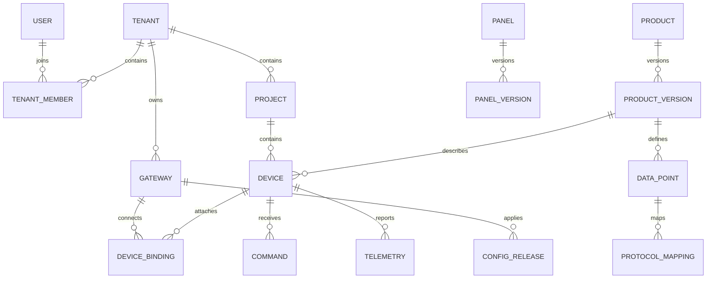

# DTU 多租户物联网平台开发计划 v1

日期：2026-09-28。状态：根据用户已确认需求形成的实施计划；尚未开始业务编码。

本文作为原《通用 DTU 物联网平台系统设计文档》的实施补充。发生冲突时，以用户确认的需求为准，其次采用本文明确列出的设计决策；未确认项不视为用户承诺。

## 1. 已确认范围

| 项目 | 决定 |
|---|---|
| 使用场景 | 通用工业控制设备，暂时没有实际设备和寄存器表 |
| 接入拓扑 | 首版一台 DTU 对应一台现场设备，未来可能一对多 |
| MCU | ESP32-S3，具体模组、Flash、PSRAM、电路尚未确定 |
| 联网 | 首版 WiFi |
| 物理接口 | RS485、RS232、TTL |
| 部署模式 | 多客户共用平台，租户数据隔离 |
| 账号 | 管理员与用户；实施时区分平台管理员、租户管理员、普通用户 |
| 设备添加 | 管理员分配与用户自主认领均支持 |
| 用户端 | H5；首版包含完整拖拽面板设计器 |
| 通知 | 首版不做外部通知 |
| OTA | 首版必须包含 |
| 技术路线 | Java + Vue；已有服务器、域名 |
| 规模、周期、团队 | 尚未确定，不给出承诺交付日期和生产容量 |

## 2. 计划采用的默认决策与待验证项

以下为实现建议，可以后续调整，区别于上面的用户确认项。

1. 首版业务协议暂定 Modbus RTU。RS485、RS232、TTL 是电气接口，不能据此推导支持所有工业设备协议。三类接口使用相同协议适配器，但分别通过真实收发电路验收。
2. 首版一个网关只启用一个现场设备绑定和一个活动业务通道；三种接口按配置选择使用。是否必须三口同时运行尚未确认，不作为首版默认承诺。
3. 首版控制支持绝对值设置：数值、枚举、布尔；不默认开放复位、清零、点动、脉冲、多步联动。没有真实设备资料前，控制能力仅在测试从站上验收。
4. 离线拒绝新控制，命令有截止时间，不将离线期间的控制排队到重连后执行；一次性动作不自动重试。
5. 基础告警包括离线、采集异常、阈值事件及恢复记录；不包括短信、邮件、微信等外部通知。
6. 用户由管理员建立或邀请加入租户；自主注册新租户暂不纳入。普通用户可在被授权的项目中认领设备。
7. WiFi 首次配网先按有实体按钮触发、限时开放的 SoftAP 配网流程设计；使用设备专属凭据保护配网，具体手机兼容性在硬件验证阶段确认。
8. 暂以 100 台模拟网关、每台 20 个点、采集 1 秒、批量上报 5 秒、20 个在线页面作为开发基线；这不是用户业务目标或生产容量承诺。历史初始保留 30 天，原始报文 24 小时，均做成配置项。
9. TTL 电平、RS232/485 收发器、隔离保护、引脚复用、供电、Flash 容量和串口同时工作要求，在固件分区和 PCB 定版前确定。ESP32-S3 UART 引脚不能直接替代 RS232/485 电气收发电路。
10. 服务器配置、操作系统、存储、备份位置、域名 DNS 和端口情况在部署阶段调查，暂按单机 Docker Compose 试点设计，不承诺高可用。

## 3. 架构与职责

采用模块化单体后端，部署中包含 Backend、Admin、H5、EMQX、PostgreSQL、Redis 和 HTTPS 入口。固件文件通过独立存储适配器提供，可先用受控文件目录，后接对象存储。

```text
Admin / H5 -> HTTPS API / WebSocket -> Backend
                                      |-- 身份、租户、项目、设备归属
                                      |-- 产品版本、映射、配置发布
                                      |-- 遥测转换、Shadow、历史、告警
                                      |-- 控制、面板、OTA、审计
                                      |-- PostgreSQL / Redis / 固件存储
DTU <-> MQTT TLS <-> EMQX <-> 接入模块
 |
WiFi + ESP32-S3 + 串口适配器
 |
RS485 / RS232 / TTL -> Modbus RTU 测试从站或现场设备
```

DTU 处理基础字节解码、采集调度、缓存、执行、配置和 OTA；服务端处理倍率、偏移、枚举语义和权限；H5 只使用业务 identifier。

现场安全联锁、急停及保护逻辑由现场 PLC/控制器承担。云端控制只作为远程操作入口，不将断网保护建立在云端实时性之上。

遥测进入后先校验并可靠接收，再标准化、去重和持久化；历史提交后更新 Shadow、触发实时告警和推送。初期使用数据库接收记录/处理状态实现故障恢复，不额外引入 Kafka。通过批处理、保留时间和压测判断这一方案的容量。

Command 与发送任务在一个数据库事务中保存，通过 outbox 异步发送。Redis 不作为命令和配置状态的唯一事实来源。

## 4. 技术栈与仓库

- Java 21、Spring Boot、Spring Security、Spring WebSocket、Maven。
- 数据访问采用 MyBatis + Flyway，避免同时维护两套 ORM。
- Vue 3、TypeScript、Vite、Pinia；Admin 使用 Element Plus，H5 使用 Vant，图表使用 ECharts。
- 拖拽布局优先验证 GridStack；Schema 与其内部格式隔离，H5 Renderer 不依赖设计器运行时。
- PostgreSQL 为持久化主库；开发阶段历史按时间分区。TimescaleDB 作为容量验证后的可选扩展，不首日部署两套独立数据库。
- Redis 用于缓存、在线租约和短期推送协调；EMQX 承担 MQTT 认证与 Topic ACL。
- 固件采用 ESP-IDF、C/C++、ESP-MQTT、HTTPS OTA；模拟器采用 Python。
- 编码启动任务锁定 Spring Boot、ESP-IDF、Node、MQTT 客户端、EMQX 等精确版本并验证兼容性，不自动沿用旧文档的大版本或无约束 latest 镜像。

```text
backend/
admin-web/
h5-web/
packages/panel-schema/
dtu-firmware/
dtu-simulator/
contracts/                 # OpenAPI、JSON Schema、二进制规范、跨语言测试向量
docs/
deploy/
```

后端模块：auth、tenant、project、identity、gateway、device、product、protocol、config、ingest、telemetry、shadow、command、panel、alarm、ota、audit。

## 5. 领域模型与数据库

首版就在数据库中分离 Gateway 与 Device，但界面提供一对一的简化创建流程。



关键表及字段如下，精确 DDL 由第一阶段任务交付：

| 表 | 主要字段和约束 |
|---|---|
| user / tenant / tenant_member | 全局用户、租户、成员角色；unique(tenant_id,user_id) |
| project / project_member | 租户内项目与用户可访问范围 |
| device_identity | 出厂硬件 ID、认证凭据引用、硬件型号、吊销状态；平台域管理 |
| gateway | tenant_id、identity_id、名称、固件版本、连接状态、desired/applied config；identity_id 唯一 |
| device | tenant_id、project_id、product_version_id、名称、业务状态；现场设备身份独立于 DTU |
| device_binding | gateway_id、device_id、port、slave_id、有效起止；同一设备只有一个活动绑定；首版网关至多一个活动绑定 |
| claim_token | identity_id、一次性认领码哈希、过期时间、使用状态；与 MQTT 凭据分开 |
| ownership_event | 原归属、新归属、操作者、事件时间；用于认领、解绑、转移审计 |
| product / product_version | tenant_id、product_key、version、draft/published、内容哈希；发布后不可原位修改 |
| data_point | product_version_id、稳定逻辑 point_id、identifier、类型、R/W/RW、单位、上下限、步长、历史设置 |
| protocol_mapping | data_point_id、point_code、读写地址/功能码/长度、raw_type、字节序、位规则、scale/offset、采集周期 |
| config_release | gateway_id、revision、完整执行快照、产品版本与绑定快照、hash、状态、应用结果；版本单调递增 |
| telemetry_inbox | gateway_id、revision、boot_id、sequence、原始批次、处理状态；唯一消息身份防重复 |
| telemetry | tenant_id、device_id、point_id、product_version_id、sample_at、received_at、类型化值、quality、来源消息 |
| shadow_snapshot | device_id、point_id、值、质量、采集时间、版本、更新游标；持久化最后已知状态 |
| command / command_event | tenant_id、device_id、gateway_id、config_revision、目标标准值/原始值、幂等键、截止时间、状态和事件 |
| outbox | 关联操作、发送载荷、重试状态、下一发送时间；与业务记录事务写入 |
| panel / panel_version | tenant_id、产品、schema、schema_version、发布版本、状态、作者 |
| panel_assignment | 产品默认或具体设备覆盖；首版暂不做无产品约束的项目级统一覆盖 |
| alarm_rule / alarm_event | 设备/数据点、阈值、持续时间、恢复条件、状态；无外部通知 |
| ota_firmware / ota_task | 型号、版本、hash、签名、大小、URL 引用、任务状态、进度、错误、升级前后版本 |
| audit_log | tenant_id、操作者、动作、对象、结果、脱敏变更、时间 |

租户内唯一键包含 tenant_id；跨表关联验证租户一致性。租户上下文来自已认证成员关系，不信任请求体中的 tenant_id。所有资源读取、历史查询、导出、WS 订阅同样检查授权。

产品的倍率、地址或类型变化产生新发布版本。identifier 和 point_code 不随意复用；历史保存稳定 point_id 和定义版本，单位/语义不兼容的历史不直接混合绘图。

更换 DTU 时保留现场 Device 身份和历史；跨租户转移硬件不转移原租户历史，新租户建立新设备记录。转移期间撤销旧访问、失效认领凭据并更新 Broker 授权，隔离旧缓存数据。

## 6. 配置与协议契约

### 6.1 配置生命周期

草稿编辑 -> 类型与总线负载检查 -> 生成不可变快照 -> 创建发布任务 -> 下发 -> DTU 校验 -> 暂停相关采集/写入 -> 原子切换 -> 上报 applied -> 恢复采集。

失败保留最后有效配置；回退操作发布一个更高 revision，其内容引用以前的有效快照。更新配置时处理或取消已有命令，禁止命令跨映射版本执行。

上报数据携带采集时 revision；离线缓存保持原 revision。服务端通过配置快照找到当时的绑定、产品版本和转换规则，不查当前映射解释旧数据。即便只改倍率，也发布对应新 revision，以确定采样解释边界。

### 6.2 MQTT

使用稳定硬件 gatewayId 构造 Topic，避免把可变租户归属编码为硬件身份：

```text
iot/v1/gateways/{gatewayId}/status
iot/v1/gateways/{gatewayId}/heartbeat
iot/v1/gateways/{gatewayId}/telemetry
iot/v1/gateways/{gatewayId}/telemetry/ack
iot/v1/gateways/{gatewayId}/command/set
iot/v1/gateways/{gatewayId}/command/reply
iot/v1/gateways/{gatewayId}/config/set
iot/v1/gateways/{gatewayId}/config/reply
iot/v1/gateways/{gatewayId}/ota/set
iot/v1/gateways/{gatewayId}/ota/progress
```

DTU 仅发布上行、仅订阅自己的下行 Topic；客户端不能指定所属租户绕过服务端归属解析。遥测、命令、配置使用 QoS 1 和应用层去重；命令 retain=false，DTU 另行验证截止时间与配置版本。在线状态可 retained，但必须结合连接会话和心跳判定，不能单凭旧状态恢复在线。

首版兼容 MQTT 3.1.1，过期检查在应用层实现，不依赖 MQTT 5 属性。TLS 验证证书和主机名；每台网关使用独立凭据，可轮换、吊销。具体凭据存储和认证形式在契约任务中锁定，避免使用未定义的 HMAC(deviceSecret) 占位公式。

### 6.3 二进制载荷 v1 草案

字段布局在跨语言 golden vectors 验证后冻结：

| 公共字段 | 建议宽度/含义 |
|---|---|
| magic / protocolVersion / messageType | 2 / 1 / 1 字节 |
| payloadLength | uint32；另限定设备和服务端可接受最大包长 |
| configRevision | uint32；0 仅用于无需采集配置的消息类型 |
| bootId | 16 字节，每次启动生成新的唯一标识 |
| sequence | uint64，启动期单调递增 |
| sampleTime | int64，UTC 毫秒；未知时间另用有效性标记表示 |
| flags | 时间可信度、补传等标记 |
| payload | 按消息类型解析 |

遥测 payload：pointCount + 多个(pointCode:uint16、rawType、quality、采样时间偏移、valueLength、rawValue)。多点不同采样时刻必须可表达；载荷统一网络字节序，独立于 Modbus 寄存器字节排列。

命令 payload：commandId、expiresAt、pointCode、rawType、rawValue；公共头指定预期 configRevision。回复包含 commandId、执行阶段、错误码及可用的回读结果。配置和 OTA 任务采用各自版本化 schema，可用 JSON 控制消息，避免为了低频元数据提前实现复杂二进制格式。

PointCode 在网关配置内唯一；未来一对多由快照路由到各 Device，而非让 H5 感知 PointCode。首版定义范围、缺失值、未知字段、异常长度、非法浮点值及版本不支持的处理方式。

### 6.4 Modbus 支持边界

- 读取：FC01/02/03/04；写入：FC05/06/15/16，根据类型和映射限制组合。
- UINT16/INT16/UINT32/INT32/FLOAT32、线圈 BOOL、寄存器 BIT 读取。
- 读写分别配置功能码和地址；32 位值校验连续寄存器数量与字节排列。
- BIT 写入首版默认禁用；只有明确支持且测试了掩码写入/设备专属策略后开放，不使用可能覆盖其他位的通用读改写冒充原子操作。
- 数值反算检查 scale 非零、范围、raw 类型溢出和可表示精度。无法准确表示时默认拒绝，后续按产品显式选择舍入策略。
- 串口采用单队列调度，控制有优先级但不能饿死采集；定义每从站超时、重试上限、退避和扫描负载上限。
- 地址统一存储协议零基地址，界面明确区分设备手册地址记法。

## 7. 数据、控制和前端一致性

### 数据

消息去重键为 gatewayId + bootId + sequence，采样解释始终绑定 revision。每个点携带 quality；失败时保留最后好值但标记不可用/过期，不用 0 冒充采集失败。

时间可信时以采样时间及序号判定新旧；时钟未知、重启或跨会话无法可靠排序时保守处理，补传只入历史，不覆盖可信实时状态。服务端接收时间单独保存。离线缓存实行容量/时间上限和溢出计数，补传限速并提供应用层持久接收 ACK，DTU 收到该 ACK 后再释放缓存。

告警仅对符合实时性和质量条件的数据计算，支持持续时间和恢复滞回；补传不产生当前实时阈值告警。Redis 丢失后从快照恢复，显示最后已知时间，不能把恢复值标为新采集。

### 控制

建议状态：CREATED -> DISPATCHED -> RECEIVED -> EXECUTING -> WRITE_ACKED -> VERIFIED。

另外记录 REJECTED、FAILED、EXPIRED、UNCONFIRMED。状态按事件合法推进，处理重复和晚到结果；已经确认执行的命令不能被晚到超时任务覆盖。

- API 使用 Idempotency-Key；同键同载荷返回原 commandId，同键不同载荷冲突。
- 每条命令保存标准值、raw 值、转换版本、执行对象和截止时间。
- 同一设备的写操作排队串行；排队中也检查截止时间。
- DTU 持久化有限命令去重记录；重复命令返回已有结果，不再次执行。
- 普通遥测值相等不能单独证明命令成功；回读必须有关联 commandId，并验证时限、误差和实际地址。
- 对 W 点，WRITE_ACKED 表示写响应确认，不伪造 VERIFIED；UI 清晰区分。
- 网络超时可能已经执行，显示 UNCONFIRMED；迟到确认补充事实，不盲目重发物理操作。
- 绝不宣称跨掉电和外部 PLC 副作用具有通用“恰好一次”保证。

### H5 与 WebSocket

订阅授权成功后发送带游标的快照，再推送更高游标的增量。断线重连先重新取得快照；首版无需完整增量日志回放。客户端忽略旧游标，慢客户端合并遥测更新，命令结果可通过 REST 补查。

推送类型：shadow、gateway_status、device_quality、command、config、panel_published、ota。权限撤销或租户切换后终止旧订阅。

## 8. 面板设计器与 Schema v1

首版完整交付拖拽、缩放、属性编辑、绑定、删除、排序、撤销重做、手机/桌面预览、草稿、发布与回滚；不以配置表单替代用户要求的设计器。

组件：Text、Number、Status、Switch、Button、Slider、Select、Progress、Gauge、LineChart、Image、AlarmCard。Button 首版只能触发已经支持的绝对值设置，不隐含脉冲/复位语义。

Schema 包含 schemaVersion、panelVersion、产品兼容范围、手机/桌面布局、组件 id/type/bind/props 和受控样式。DataPoint 是单位、类型和访问能力的事实来源，面板不得自行改变业务单位含义。

发布校验：绑定存在、读写权限匹配、参数类型正确、布局合法、无脚本/任意 HTML、组件数量受限、资源 URL 受控。旧 Renderer 遇到未知组件显示占位，不执行未知能力；发布前检查最低 Renderer 版本。

PC 设计器与 H5 共用 Schema 校验和渲染组件定义；设计器预览使用实际 Renderer。PanelVersion 可独立发布，但必须兼容设备当前产品版本。

## 9. REST API 范围

统一 /api/v1；分页、错误码、UTC 毫秒时间和审计字段统一定义。

| 领域 | 主要接口 |
|---|---|
| 登录 | POST /auth/login、/refresh、/logout；GET /me；POST /auth/tenant |
| 租户成员 | /tenants、/members、/projects、/project-members，按角色限定操作 |
| 出厂身份 | /platform/device-identities；认领码生成、吊销、重置走独立审计接口 |
| 设备归属 | POST /gateway-claims；POST /gateways/{id}/assign、/release；不开放无校验强制抢占 |
| 接入 | /gateways、/devices、/device-bindings；绑定变更生成配置发布 |
| 产品 | /products、/products/{id}/versions；/product-versions/{id}/points、/mappings、/publish |
| 配置 | POST /gateways/{id}/config-releases；GET /config-releases/{id}；POST /config-releases/{id}/rollback |
| 状态历史 | GET /devices/{id}/shadow、/history；限制时间范围、点数与返回样本数 |
| 控制 | POST /devices/{id}/commands；GET /commands/{id}、/devices/{id}/commands |
| 面板 | /panels、/panels/{id}/versions、/publish、/rollback；GET /devices/{id}/panel |
| 告警 | /alarm-rules、/alarm-events；确认和恢复语义分开 |
| OTA | /ota/firmwares、/ota/tasks、/ota/tasks/{id}；任务按设备输出状态 |
| 审计 | GET /audit-logs，按租户与权限过滤 |

设备认领在事务中校验一次性码、当前归属、项目权限，并保证并发只有一个成功者。设备码可公开，认领码不能用可枚举设备码代替；恢复出厂设置不自动解除云端归属。

## 10. 固件与 OTA

固件模块：identity、provisioning、wifi、mqtt、codec、config、serial、modbus、polling、command、offline-cache、ota、health、log。

实施顺序：开发板启动/WiFi -> 串口电路验证 -> MQTT 身份 -> 单点读取 -> 配置切换 -> 控制回读 -> 缓存补传 -> OTA 与长稳验证。

OTA 状态：CREATED、NOTIFIED、DOWNLOADING、VERIFIED、REBOOTING、SELF_TEST、SUCCEEDED / FAILED / ROLLED_BACK。

- HTTPS 下载；校验型号、固件大小、hash、签名、协议兼容性和可用空间。
- 使用双应用分区和 OTA 元数据，分区大小根据真实构建产物与 Flash 容量确定。
- 新固件启动后完成规定的自检再标记有效；不把远端服务器短时不可达作为唯一失败依据。
- 升级前停止接收新控制，妥善结束当前串口事务；升级期间 UI 显示维护状态。
- 断网可重试，断电不得破坏最后有效应用；具体断点续传能力由选定 ESP-IDF 版本验证后实现。
- 签名私钥不进入代码仓库或普通 Web 配置，独立保存；平台管理员管理固件，租户管理员只能对授权网关发起兼容升级。
- 第一版支持单台和小批选择升级，限制并发，不做复杂灰度策略平台。
- Secure Boot/Flash Encryption 的量产烧录方案单独验证；不在探索性测试中随意烧写不可逆 eFuse。

## 11. 阶段、依赖与验收

| 阶段 | 交付物 | 完成条件 |
|---|---|---|
| P0 契约与硬件探路 | 决策记录、DDL 草案、协议、依赖版本、开发板串口与 Flash 实测 | 二进制 C/Python/Java 测试向量一致；接口/OTA 资源限制明确 |
| P1 平台与身份 | 仓库、Compose、登录、多租户、身份库存、认领与授权 | 两租户读取/修改/WS/MQTT 越权均失败；并发认领只有一次成功 |
| P2 版本化模型与采集 | 产品发布、配置、模拟器、转换、Shadow、历史基础 | 旧版本缓存按旧映射解释；重复/乱序不污染最新状态 |
| P3 控制闭环 | 命令、outbox、执行与回读、基础操作页面 | 重复命令不重复执行；版本不符拒绝；超时和迟到结果正确 |
| P4 真实 DTU 联调 | 三接口验证、配网、采集、写入、缓存 | ESP32-S3 接测试从站通过；断网重启恢复有效配置；资源有余量 |
| P5 动态面板与设计器 | 全部首版组件、拖拽、移动布局、版本发布、H5 | 后台发布后 H5 自动使用兼容新面板；回滚和断线同步正确 |
| P6 OTA、历史与告警完善 | OTA、曲线查询与保留策略、基础事件 | 断电/坏签名/错误型号升级测试通过；历史限制生效 |
| P7 部署与交付 | 运维文档、备份恢复、压力与稳定性报告 | 服务器完成部署；备份可恢复；已知限制记录并验收 |

关键路径：协议/版本模型 -> 身份与配置 -> 遥测 -> 控制 -> 真机稳定性/OTA -> 部署验收。

允许并行的工作仅表示依赖关系：P0 硬件验证可与平台契约设计同时推进；P2 后设计器可与固件实现并行；OTA 分区验证在 P0/P4 进行，不等到 P6 才发现 Flash 不足。此计划不假定已有多人团队。

## 12. 任务清单

每项为工作包，涉及实现的包在启动时拆为约 0.5～2 人日的子任务；硬件交期、真实设备适配、生产容量验证不计入这个粒度假设。下表估计是拆分建议，不是交付时间承诺。

| ID / 阶段 | 目标、输入 -> 输出 | 文件范围 | 数据库 / API 变化 | 测试与验收 | 依赖 |
|---|---|---|---|---|---|
| T01/P0 | 需求与假设 -> ADR、支持矩阵、风险清单 | docs/ | 无 | 物理接口与协议分开、未确认项可追踪 | 无 |
| T02/P0 | 已选技术 -> 版本锁定、骨架、开发环境 | backend/、前端、deploy/ | health/readiness | 构建通过、服务健康、依赖版本可复现 | T01 |
| T03/P0 | 模型决策 -> ER、DDL、迁移 | docs/database.md、backend/migrations/ | 核心表草案 | 唯一约束、租户关联、升级回退策略审查 | T01 |
| T04/P0 | 协议草案 -> 二进制/配置/WS 契约与向量 | contracts/、docs/ | OpenAPI 初稿 | C/Python/Java 解码一致，非法包拒绝 | T01 |
| T05/P0 | ESP32-S3 -> 硬件能力报告与最小固件 | dtu-firmware/、docs/hardware.md | 无 | WiFi、三接口测试方案、Flash/分区预算明确 | T01 |
| T06/P1 | 用户/租户设计 -> 登录、角色、项目授权 | backend/auth、tenant、project；前端登录 | 身份成员表、auth/project API | 双租户横向越权和会话失效测试通过 | T02,T03 |
| T07/P1 | 身份与归属设计 -> 出厂库存、认领、分配 | backend/identity、gateway、device | 身份/认领/绑定表与 API | 并发认领、转移后旧访问撤销 | T06 |
| T08/P1 | 网关身份 -> MQTT Auth/ACL | backend/mqtt、deploy/emqx | Broker 认证接口 | 伪造 Topic、跨网关订阅拒绝 | T07 |
| T09/P2 | 产品定义 -> 草稿/发布/不可变版本 | backend/product、protocol；admin 产品页 | 产品/点/映射表与 API | 非法映射拒绝；发布后修改产生新版本 | T03,T06 |
| T10/P2 | 发布产品+绑定 -> 配置生成与应用跟踪 | backend/config；admin 配置页 | config_release、outbox、配置 API | 应用失败不改变 applied；旧数据版本可查 | T04,T07,T09 |
| T11/P2 | 契约 -> 模拟器 | dtu-simulator/ | 无，使用 MQTT 契约 | 正常/断线/重复/乱序/旧版本/错误类型可复现 | T04,T08 |
| T12/P2 | 遥测 -> 持久接收与转换 | backend/ingest、telemetry | inbox、telemetry | ACK 后重启不丢已接收批次，转换版本正确 | T10,T11 |
| T13/P2 | 标准值 -> Shadow、质量、WS 快照 | backend/shadow、websocket；h5 状态页 | shadow_snapshot、shadow/WS API | 旧值不覆盖、订阅无窗口遗漏、越权拒绝 | T12 |
| T14/P3 | 控制请求 -> 命令与 outbox | backend/command | command/event、commands API | 幂等冲突、过期、并发、重启恢复 | T10,T13 |
| T15/P3 | 命令 -> 模拟执行与关联回读 | dtu-simulator/、backend/command | 扩展 command 事件 | 回复丢失/迟到/不匹配回读正确处理 | T11,T14 |
| T16/P4 | 硬件与契约 -> 配网/MQTT/配置固件 | dtu-firmware/ | 无 | TLS、配网超时、配置原子切换和断电恢复 | T05,T08,T10 |
| T17/P4 | 映射 -> 真实串口采集与调度 | dtu-firmware/serial、modbus、polling | 无 | RS485/232/TTL 各通过测试从站；超时不阻塞全部队列 | T16 |
| T18/P4 | 控制协议 -> 真机写入、回读、缓存 | dtu-firmware/command、cache | 无 | 版本错拒绝、重复不执行、补传限速与溢出可见 | T15,T17 |
| T19/P5 | DataPoint -> Schema 校验与 Renderer | packages/panel-schema、h5/panel | panel/version、面板读取 API | 所有组件、异常值、未知组件、移动布局 | T09,T13 |
| T20/P5 | Renderer -> 完整拖拽设计器 | admin/panel-designer | panel 草稿/版本 API | 拖拽缩放、撤销重做、绑定校验、真实预览 | T19 |
| T21/P5 | 草稿 -> 发布/回滚及 H5 全流程 | backend/panel、admin、h5 | panel_assignment、发布 API | 兼容性阻断、设备覆盖、历史/控制入口可用 | T14,T20 |
| T22/P6 | 历史数据 -> 查询/聚合/保留 | backend/history、h5/chart | history API、分区清理 | 范围限制、时区、断档、单位版本隔离 | T12,T19 |
| T23/P6 | 数据质量与阈值 -> 告警事件 | backend/alarm、admin、h5 | alarm 表与 API | 持续时间、恢复、补传不误报、无外部发送 | T13 |
| T24/P6 | 固件产物 -> 上传、签名元数据、OTA 任务 | backend/ota、admin/ota、deploy/ | firmware/task、OTA API | 型号授权校验、签名错误、任务恢复 | T07,T16 |
| T25/P6 | OTA 任务 -> 下载、切换、自检回滚 | dtu-firmware/ota | OTA 状态消息 | 断电、断网、错误版本、自检失败回滚 | T18,T24 |
| T26/P7 | 各模块 -> 全链路回归与容量报告 | tests/、simulator/、docs/ | 无 | 下节用例通过，记录资源与已知上限 | T21,T22,T23,T25 |
| T27/P7 | 服务器条件 -> 部署、备份、恢复手册 | deploy/、docs/deployment.md | 生产配置，不公开密钥 | HTTPS/MQTT TLS、备份恢复、回滚演练 | T26 |

## 13. 第一个迭代：可直接执行的任务

目标：稳定契约和开发环境，得到最小硬件通信证据；不开始堆完整 UI。

1. T01：建立 architecture、domain-model、decision-log、hardware-support-matrix，列出本文默认假设。
2. T02：锁定依赖版本，创建后端/前端/模拟器骨架、Compose 和环境变量示例，打通健康检查。
3. T03：完成租户、Gateway/Device、产品版本、配置快照的迁移和约束验证。
4. T04：冻结 v1 首批消息（telemetry/config/command）的精确字节结构及测试向量；写清 ACK、时间和去重规则。
5. T05：有开发板时验证 WiFi 和 UART 测试从站；缺少收发器时记录实物阻塞，但继续桌面 codec/模拟器工作，不能宣称接口验收完成。
6. 时间允许后启动 T06/T08 的最小身份闭环，避免先开发无鉴权设备接入再返工。

迭代退出条件：仓库可构建、环境可启动、迁移可复现、跨语言载荷一致、版本规则明确、硬件缺口有清单。软件契约通过后进入采集闭环；硬件未到位不阻塞模拟器，但阻塞真机阶段签收。

## 14. 验收与容量方法

必须覆盖：两租户隔离、重复认领、解除归属后的订阅撤销、非法载荷、重复和乱序、DTU 重启、配置切换掉电、旧配置补传、raw 类型异常、串口超时、重复命令、执行后丢回复、迟到回读、WS 重连、Redis 丢失、后端处理阶段崩溃、设计器发布回滚、OTA 各阶段断电与错误签名。

模拟器与真实测试从站使用同一组协议向量；真实串口至少验证一个普通寄存器、一个 32 位值、一个开关和一次控制回读。没有实际工业设备资料时，只能验收平台与标准测试设备兼容性，不宣称兼容所有工业设备。

容量从临时开发基线逐级增加，记录 msg/s、点/s、数据库写入与积压、WS 扇出、命令各阶段 P95、CPU/RAM、每日磁盘增长。每次报告写清硬件、点数、采集/上报频率和测试时长。原文“10,000 在线、1,000 msg/s、控制 <2 秒”作为候选目标，不能在需求待定时直接作为首版承诺。

离线缓存容量以可用 Flash、擦写预算、每条记录大小和上传节奏实测得出，不承诺固定离线天数。部署前完成至少一次备份恢复；数据库、Redis 管理端口和 Broker 管理后台不直接公开。

## 15. 交付边界

交付：源代码、构建/部署配置、数据库迁移、API/消息/Schema 文档、模拟器、ESP32-S3 固件工程、管理员和用户使用说明、测试报告、OTA 操作与恢复指南、已知限制。

不包括：自定义协议的任意脚本解析、小程序、4G、CAN、复杂规则引擎、一次性动作通用重试、跨设备联动、复杂 SaaS 计费、外部通知、未经实测的万人设备容量保证。

本文未修改原设计文档。后续开发以本文澄清的实现决策为基础，并同步维护 contracts/ 与 docs/；Git 提交信息使用中文。

## 16. 核对来源

- ESP32-S3 UART 与外部收发器依据：[ESP32-S3 Technical Reference Manual](https://documentation.espressif.com/esp32-s3_technical_reference_manual_en.pdf)。
- OTA 签名与回滚能力：[ESP-IDF ESP32-S3 Security](https://docs.espressif.com/projects/esp-idf/en/v5.3.2/esp32s3/security/security.html)。具体行为按启动任务锁定的 SDK 版本重新验证。
- Java 与 Spring Boot 兼容性：[Spring Boot System Requirements](https://docs.spring.io/spring-boot/system-requirements.html)。本文采用 Java 21，Boot 精确版本在 T02 锁定。
- MQTT 投递语义：[MQTT 3.1.1 Specification](https://docs.oasis-open.org/mqtt/mqtt/v3.1.1/mqtt-v3.1.1.html)。
- Modbus 功能码与数据模型：[Modbus Application Protocol V1.1b3](https://modbus.org/docs/Modbus_Application_Protocol_V1_1b3.pdf)。
